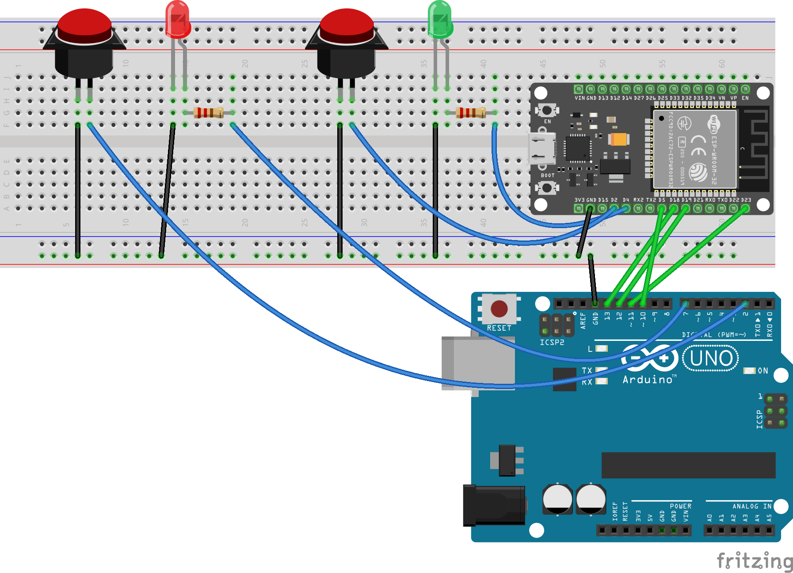
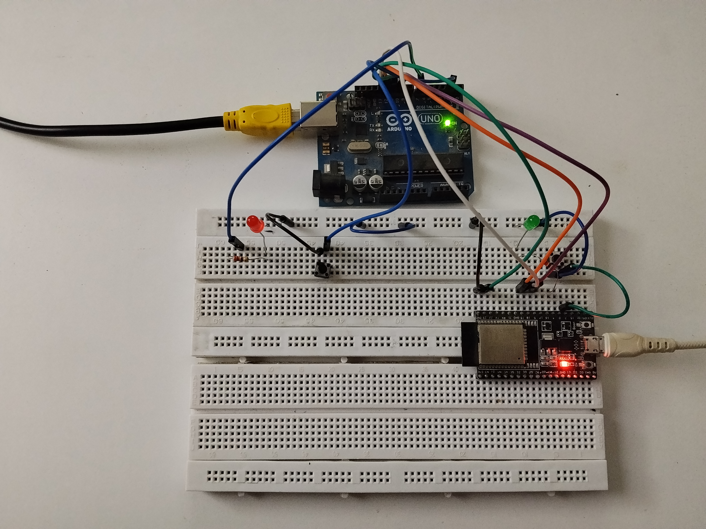

# SPI Communication – Master & Slave

A simple embedded communication project demonstrating SPI (Serial Peripheral Interface) communication between a Master device and a Slave device.

## Project Overview

This project demonstrates how two embedded devices can communicate using the SPI communication protocol.

One device operates as the SPI Master and controls the communication, while the other device operates as the SPI Slave and responds to data transmitted by the Master.

The project demonstrates SPI communication, Master/Slave architecture, data transmission, and hardware interfacing.

## Features

- SPI Master/Slave communication
- Serial Peripheral Interface (SPI) protocol
- Master-controlled communication
- Data transmission between two devices
- Fritzing circuit diagram
- Hardware implementation
- Arduino-based embedded programming

## Hardware

- Arduino-compatible development boards
- Breadboard
- Jumper wires
- USB cables
- SPI-compatible hardware

## SPI Communication

SPI is a synchronous serial communication protocol commonly used in embedded systems.

It typically uses four main signals:

| SPI Signal | Description |
|---|---|
| MOSI | Master Out, Slave In |
| MISO | Master In, Slave Out |
| SCK | Serial Clock |
| SS / CS | Slave Select / Chip Select |

The Master generates the clock signal and controls the Slave Select line. The Slave communicates with the Master when it is selected.

## Master and Slave

### SPI Master

The Master initiates communication and generates the SPI clock.

The `SPI_Master.ino` file contains the code for the SPI Master device.

### SPI Slave

The Slave responds to communication initiated by the Master.

The `SPI_Slave.ino` file contains the code for the SPI Slave device.

## Pin Configuration

For an Arduino Uno/Nano-style SPI interface:

| SPI Signal | Arduino Pin |
|---|---|
| MOSI | D11 |
| MISO | D12 |
| SCK | D13 |
| SS / CS | D10 |
| GND | GND |

The corresponding SPI pins should be connected between the Master and Slave devices.

> Note: SPI pin assignments may vary depending on the microcontroller or development board being used.

## Circuit Diagram

### Fritzing Diagram



### Hardware Setup



## How It Works

1. The SPI Master initializes the SPI interface.
2. The SPI Slave initializes its SPI interface and waits for communication.
3. The Master selects the Slave using the SS/CS signal.
4. The Master generates the SPI clock.
5. Data is transmitted through the MOSI line.
6. The Slave can return data through the MISO line.
7. The communication continues according to the SPI configuration.
8. The Master releases the Slave Select line when the transmission is complete.

## SPI Data Transfer

SPI supports full-duplex communication, meaning data can be transmitted and received simultaneously.

```text
Master                         Slave
  |                              |
  | -------- MOSI ------------> |
  | <-------- MISO ------------ |
  | -------- SCK -------------> |
  | -------- SS/CS -----------> |
  |                              |

| File                             | Description                 |
| -------------------------------- | --------------------------- |
| `SPI_Master.ino`                 | SPI Master source code      |
| `SPI_Slave.ino`                  | SPI Slave source code       |
| `SPI-communication-Fritzing.png` | Fritzing circuit diagram    |
| `SPI-communication.jpg`          | Hardware setup              |
| `SPI-communication.mp4`          | Communication demonstration |

Applications

SPI communication is widely used in embedded systems for interfacing with:

Sensors
Displays
Memory devices
ADC/DAC modules
RFID modules
Other microcontrollers and peripherals
Technologies
Arduino
Embedded C/C++
SPI Communication
Fritzing
Microcontroller Interfacing
Demo

A hardware demonstration of the SPI communication is available in:

SPI-communication.mp4

License

This project is intended for educational and embedded systems learning purposes.
